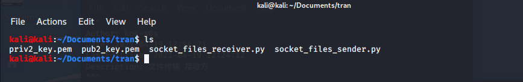

关键字：python 、socket 、 openssl

**<font size=6 color=red>发送方</font>**

```python
import socket
import tqdm
import os
import sys

# 传输数据分隔符
SEPAEATOR = "<SEPARATOR>"

# 服务器信息
host = "192.168.178.129"
port = 5555

# 文件传输的缓冲区
BUFFER_SIZE = 4096

# 待传输文件名字
filename = str(sys.argv[1])

# 文件大小
file_size = os.path.getsize(filename)

# 创建socket连接
s = socket.socket()

# 连接服务器
print(f"服务器连接中{host}:{port}")
s.connect((host, port))
print("与服务器连接成功")

# 发送文件名字和文件大小，必须进行编码处理encode()
s.send(f"{filename}{SEPAEATOR}{file_size}".encode())

# 文件传输 progress进度条
progress = tqdm.tqdm(range(file_size), f"发送{filename}", unit="B", unit_divisor=1024)
with open(filename, "rb") as f:
    for _ in progress:
        # 读取文件
        bytes_read = f.read(BUFFER_SIZE)
        if not bytes_read:
            break
        # sendall确保即使网络忙碌的时候，数据仍然可以传输
        s.sendall(bytes_read)
        progress.update(len(bytes_read))

# 关闭资源
s.close()

```

**<font size=6 color=red>接受方</font>**

```python
import socket
import tqdm
import os

# 设置服务器的IP和端口
SERVER_HOST = "192.168.178.129"
SERVER_PORT = 5555

# 设置文件读写缓冲区
BUFFER_SIZE = 4096

# 传输数据分隔符
SEPAEATOR = "<SEPARATOR>"

# 创建Server
s = socket.socket()
s.bind((SERVER_HOST, SERVER_PORT))

# 设置连接监听数
s.listen(5)
print(f"服务器端监听{SERVER_HOST}:{SERVER_PORT}")

# 接受客户端连接
client_socket, address = s.accept()

# 打印客户端的IP
print(f"客户端{address}连接")

# 接受客户端信息
received = client_socket.recv(BUFFER_SIZE).decode()
filename, file_size = received.split(SEPAEATOR)

# 获取文件名字
filename = os.path.basename(filename)
file_size = int(file_size)

# 文件接受处理
progress = tqdm.tqdm(
    range(file_size), f"接受{filename}", unit="B", unit_divisor=1024, unit_scale=True
)

with open(filename, "wb") as f:
    for _ in progress:
        bytes_read = client_socket.recv(BUFFER_SIZE)
        # 如果没有数据传输内容
        if not bytes_read:
            break
        # 读取写入
        f.write(bytes_read)
        # 更新进度条
        progress.update(len(bytes_read))

# 关闭资源
client_socket.close()
s.close()

```


people_1:：Ubuntu20.04 host：`192.168.178.128`

people_2：kali host：`192.168.178.129`


people_1生成公私钥


people_2生成公私钥




people_1和people_2互相交换公钥


people_1用people_2给的公钥做加密操作生成加密文件cipher.txt


people_1用自己的私钥对加密文件做签名操作生成signature.txt


people_1将cipher.txt和signature.txt发送给people_2


people_2用自己的私钥解密加密文件得到原始文件


这是people_1中data.xml存储的数据


people_2用people_1给的公钥验证该签名


至此，该xml文件被认为是安全传输到目的主机。