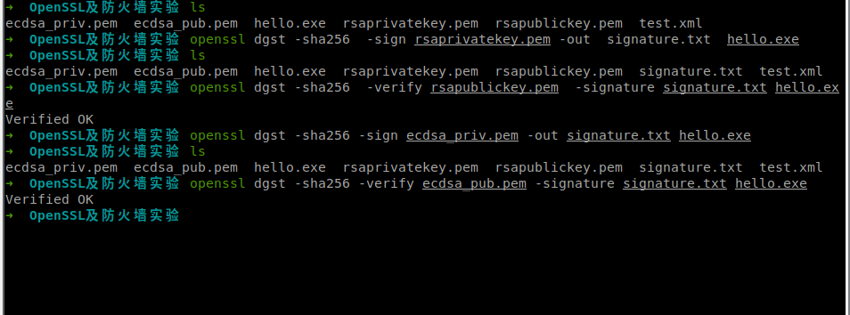

## RSA

自己签发一对RSA和ECDSA公私钥

### Q1

对一个exe文件生成签名/验签

RSA && ECDSA

### Q2

对一个xml文件进行加密/解密

DSA算法只能进行签名，不能用于加密解密

RSA加解密

## 防火墙

系统：Ubuntu20.04

工具：gufw，ufw

task：

- 外部用户不可以访问内部
- 内部用户只可以访问外部80端口

测试外部用户能否访问该主机
Xshell链接

将`Incoming`和`Outgoing`都`deny`后，使用Xshell进行访问连接，连接失败。

测试内部用户只能通过80端口访问外部

先将`HTTP:80`，`HTTPS:443`，`DNS:53`端口都开放，连接再将`443`端口关闭，访问B站`https://bilibili.com`失败，浏览器显示一直是加载状态。

我将`443`端口再次开放，此时浏览器加载完毕，我能够正常访问`https`网站。

然后这个`80`端口开启后，我是能正常访问`http`网站。

我再把`80`关了，刷新是一直在加载的状态。

**具体演示效果**

